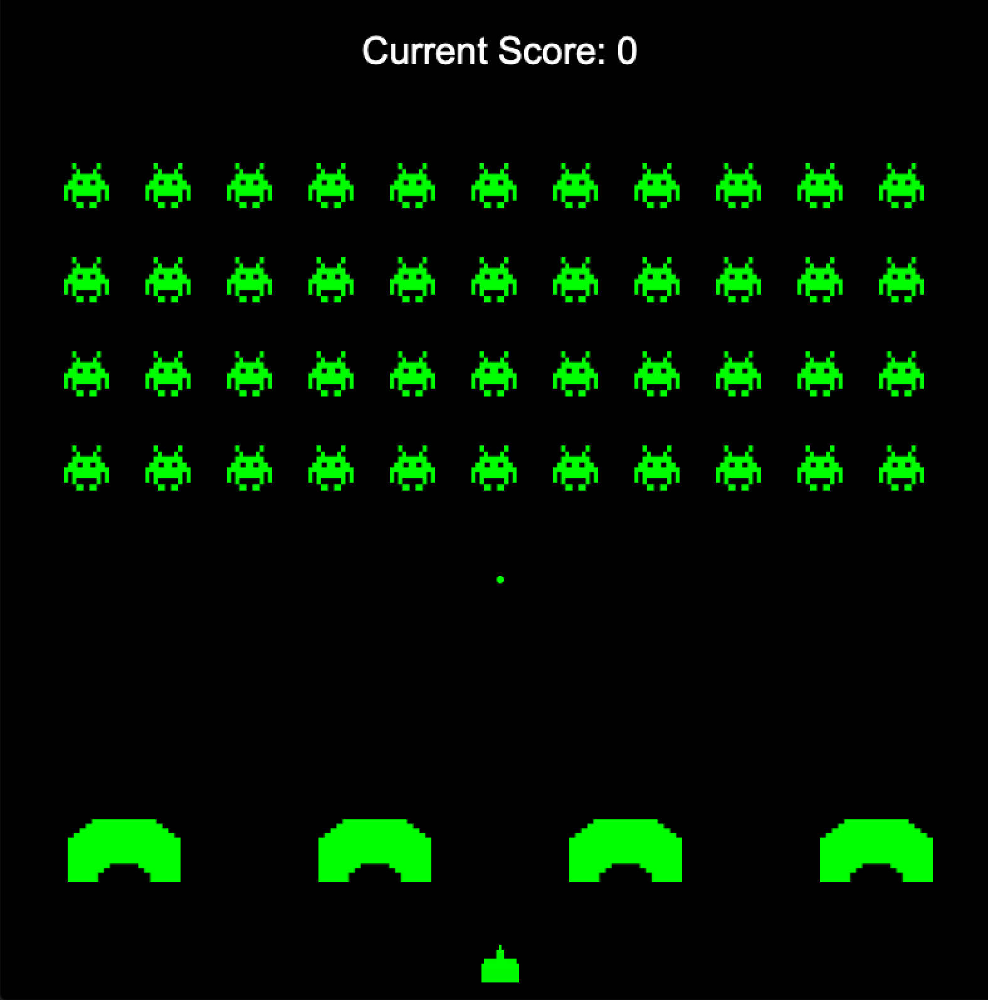

# Final Project

**Author**: Jonathan He - [`he50@illinois.edu`](mailto:he50@illinois.edu)
# Space Invaders



## Dependencies

- [CLion]
- [cmake]
- [Cinder]

## Libraries

- [Box2D]
- [SQLite]
- [gflags]

## Getting Started

### Prerequisites

The latest versions of the following software are required:
- [CLion]
- [cmake]
- [gflags]
- [Box2D]
- [SQLite]
- [Cinder]

#### Creating the project

1. Download Cinder
2. Create a project folder for the application.
3. After, do:
```sh
git clone https://github.com/CS126SP20/final-project-he50.git
```

Install Box2D, the necessary dependencies, and libraries.

Then Build!

## Controls

### Game

Rules: 
* Use the right and left arrow keys to move the player.
* Hit space to shoot at the invaders.
* Use the shield to protect your player from incoming invader shots.
* Destroy all invaders and win!


#### Keyboard

| Key       | Action                                                      |
|---------- |-------------------------------------------------------------|
| `Right`   | Move to the right                                           |
| `Left`    | Move to the left                                            |
| `SPACE`   | Shoot Missile                                               |
| `R`       | Restart the game                                            |
| `ESC`     | Quit the game                                               |


[CLion]: https://www.jetbrains.com/clion/
[clang]: https://clang.llvm.org/
[cmake]: https://cmake.org/
[SQLite]: https://www.sqlite.org/index.html
[Box2D]: https://box2d.org
[gflags]: https://github.com/gflags/gflags
[Cinder]: https://libcinder.org
